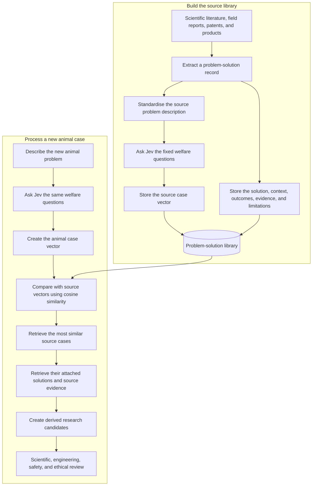

# Jev Welfare-Case Analogy Pipeline

> **Status:** Exploratory approach; not implemented or validated  
> **Purpose:** Preserve a candidate method for generating traceable, cross-domain animal-welfare research hypotheses  
> **Role in the wider project:** One possible analogy-retrieval strategy, not the complete Animal Welfare Scientist architecture

## 1. Summary

This approach attempts to engineer useful serendipity by finding known problems with welfare or health profiles similar to a new animal-welfare problem.

The system:

1. Defines a fixed, versioned set of welfare and health dimensions.
2. Represents known population/problem cases using those dimensions.
3. Stores explicit, evidence-backed links from known problem cases to solutions.
4. Represents a new animal-welfare case using the same dimensions.
5. Uses cosine similarity to retrieve known cases with similar profiles.
6. Transfers the solutions attached to the retrieved cases as **unverified research candidates**.

The transfer does not establish that a solution works in the new species or context. It produces a hypothesis worth investigating.

```text
new animal problem
        |
        v
Jev welfare profile
        |
        v
similar known problem ---- established relationship ----> known solution
        |
        v
solution transferred as a derived, unverified candidate
```

## 2. Core principle

The system matches **problem to problem**, not problem to solution.

Solutions are not vectorised in the first version. A solution is retrieved because it is explicitly attached to a similar known problem case.

```text
Known source case A -> Solution X

New animal case B ~= Known source case A

Therefore:
New animal case B -> investigate Solution X
```

The final relationship is a hypothesis. Evidence supporting `A -> X` does not automatically support `B -> X`.

## 3. What Jev contributes

[Jev](https://typesafe.ai/) is a structured decision model from TypeSafe AI. It receives a state plus bounded questions and returns typed decisions rather than open-ended prose. TypeSafe describes three main question types: choice, ordered score, and a yes/no probability.

In this approach, Jev is used only as a repeatable classifier. For every problem case, the system asks one independent yes/no question per welfare dimension.

Example:

```text
State:
Broiler chickens show persistent feeding behaviour, rapid excessive
weight gain, inflammatory indicators, and impaired walking.

Question:
Is insufficient satiety a material feature of this case?

Output:
Probability of yes: 0.80
```

Ordinary code collects the answers in a fixed order:

```text
[
  P(insufficient satiety),
  P(excess adiposity),
  P(pain),
  P(inflammation),
  P(mobility impairment),
  P(heat stress),
  P(fear),
  P(tissue damage),
  P(infection)
]
```

Jev does **not**:

- define the welfare dimensions;
- search scientific literature or patents;
- find solutions by itself;
- calculate the final case similarity;
- establish that a transferred intervention is safe or effective;
- replace scientific or engineering review.

The project defines the questions. Jev returns probabilities. Ordinary code assembles the vector, computes similarity, joins database records, and labels the result.

### Why the dimensions must be independent questions

The dimensions can occur together. A case can involve pain, inflammation, tissue damage, and infection at the same time.

They must therefore be separate yes/no questions. They must not be options in one Jev `choice` question, because choice probabilities compete and sum to one.

## 4. What is and is not vectorised

### Vectorised

- Known population/problem cases extracted from the source literature
- New animal-welfare population/problem cases

Every case uses the same dimension definitions, question wording, ordering, and schema version.

### Not vectorised in version one

- Solutions
- Drugs
- Technologies
- Patents
- Causes
- Biological mechanisms
- Technology primitives
- Evidence papers
- Species labels
- Adoption considerations

These remain explicit records and contextual fields.

## 5. What the predefined dimensions mean

The dimensions are a shared vocabulary for describing harmful welfare or health states. They are intended to say **what is wrong**, not why it happened or how to fix it.

A dimension should ideally be:

- meaningful across multiple species;
- independent enough to add information;
- solution-neutral;
- defined precisely enough for repeatable scoring;
- assessable from a reasonably detailed case description;
- at roughly the same level of abstraction as the other dimensions.

The provisional dimensions discussed for an initial experiment are:

| ID | Dimension | Standard question |
|---|---|---|
| D01 | Insufficient satiety | Is inadequate satiety a material feature of this case? |
| D02 | Excess adiposity | Is excessive body fat a material feature of this case? |
| D03 | Pain | Is pain a material feature of this case? |
| D04 | Inflammation | Is inflammation a material feature of this case? |
| D05 | Mobility impairment | Is impaired movement a material feature of this case? |
| D06 | Heat stress | Is harmful heat stress a material feature of this case? |
| D07 | Fear | Is fear or acute distress a material feature of this case? |
| D08 | Tissue damage | Is physical tissue damage a material feature of this case? |
| D09 | Infection | Is infection a material feature of this case? |

This is a provisional test set, not a comprehensive welfare ontology.

Each production dimension record would also need:

- a full definition;
- inclusion and exclusion rules;
- a definition of “materially present”;
- positive, negative, and ambiguous examples;
- an applicable timeframe;
- a schema version;
- expert review notes.

### Interpretation of a value

A value should mean:

> Jev's estimated probability that this dimension is a material feature of the described case.

It should not be interpreted as:

- severity of suffering;
- prevalence within the population;
- strength of scientific evidence;
- intervention priority;
- certainty that the case description is complete.

Those are separate concepts.

## 6. Main entities

### Dimension

A fixed comparison axis and its standard question.

### Problem case

A standardised description of a population experiencing a problem in a defined context.

Examples:

- adults with obesity and impaired satiety;
- broilers with excessive weight gain and impaired walking;
- piglets experiencing skin lesions from wet contaminated flooring.

### Dimension assessment

Jev's probability for one dimension in one problem case, including the model and question versions.

### Case vector

The ordered collection of dimension assessments for a problem case.

### Solution

A drug, biological intervention, material, physical design, sensor, operational practice, or other intervention.

### Known case-to-solution relationship

An explicit claim that a solution was studied or used for a source problem case.

### Evidence record

A paper, field study, technical report, patent, product record, or other source attached to a known relationship.

### Similarity match

The result of comparing a new animal case vector with a stored source case vector.

### Derived candidate

A solution transferred from a similar source case to a new animal case. Its status is unverified until direct evidence is obtained.

### Validation evidence

New evidence specifically testing the derived candidate in the target population and context.

## 7. End-to-end pipeline



## 8. Building the problem-solution library

The unit stored in the library is not “a solution for a dimension.” It is a complete contextual relationship:

```text
population/problem case -> solution -> observed outcome
```

For each useful source, extract:

- the affected population;
- the standardised problem description;
- the context and timeframe;
- the intervention or technology;
- the outcomes measured;
- the direction and size of the reported effect, where available;
- the study or source type;
- limitations and contradictory findings;
- enough citation information to recover the source.

Then pass only the source problem description through Jev.

Multiple papers may support one standardised relationship. Ten papers about similar human obesity populations and the same intervention could become one source case, one relationship, and ten evidence records rather than ten duplicate cases.

### Suggested source order

1. Systematic reviews and established guidelines
2. Controlled trials and field studies
3. Credible engineering and technical reports
4. Product evaluations and documented deployments
5. Patents and academic prototypes

Patents expand the proposed solution space but normally do not prove effectiveness. Patent-only candidates must retain that status.

### Suggested initial library

Begin with a small, manually reviewed gold set rather than automated mass ingestion:

- roughly 40–100 source relationships;
- deliberately sampled across medicine, engineering, materials, sensing, and operational systems;
- including positive, ineffective, harmful, and uncertain relationships;
- reviewed for accurate problem description and evidence attribution.

## 9. Worked biological example

All numerical values below are illustrative.

### Source case

```text
Case C001:
Adults with obesity, persistent hunger, impaired satiety,
systemic inflammation, and some mobility limitation.
```

Jev profile:

| Dimension | Probability |
|---|---:|
| Insufficient satiety | 0.95 |
| Excess adiposity | 0.95 |
| Pain | 0.25 |
| Inflammation | 0.55 |
| Mobility impairment | 0.45 |
| Heat stress | 0.10 |
| Fear | 0.20 |
| Tissue damage | 0.15 |
| Infection | 0.05 |

Known relationship:

```text
C001 -> GLP-1 receptor agonist
```

The relationship retains evidence about the studied human population, intervention, outcomes, limitations, and source quality.

### New target case

```text
Case T001:
Broiler chickens showing persistent feeding behaviour,
excessive weight gain, inflammatory indicators, and impaired walking.
```

Jev profile:

| Dimension | Probability |
|---|---:|
| Insufficient satiety | 0.80 |
| Excess adiposity | 0.90 |
| Pain | 0.35 |
| Inflammation | 0.60 |
| Mobility impairment | 0.55 |
| Heat stress | 0.20 |
| Fear | 0.25 |
| Tissue damage | 0.25 |
| Infection | 0.10 |

Illustrative cosine similarity between C001 and T001: approximately `0.99`.

Derived result:

```text
Candidate:
Investigate whether intervention in the GLP-1 pathway has a relevant
application to the broiler problem.

Status:
Derived, unverified research hypothesis.

Evidence boundary:
The retrieved evidence supports the original human relationship only.
It does not establish safety or effectiveness in broilers.
```

Relevant review would include comparative physiology, existing poultry evidence, veterinary safety, food-chain regulation, ethics, possible adverse effects, and whether the apparent welfare similarity reflects a transferable mechanism.

## 10. Worked physical-intervention example

### Source case

```text
Case C002:
Piglets experiencing painful skin damage and infection associated
with prolonged contact with wet, waste-contaminated flooring.
```

Known relationship:

```text
C002 -> raised perforated flooring with drainage
```

The source case would score highly on pain, inflammation, tissue damage, and infection.

### Target case

```text
Case T002:
Broilers experiencing footpad damage associated with prolonged
contact with wet, contaminated litter.
```

If T002 retrieves C002, raised or waste-separating flooring becomes an unverified physical-design candidate.

### Important limitation

Welfare similarity alone does not prove that the physical causes match. Burns, pressure injuries, infectious wounds, and wet-contact lesions may produce similar welfare vectors while requiring different interventions.

Every case should therefore retain a non-vectorised functional description, for example:

```text
Separate the animal from wet contaminated substrate while safely
supporting its weight, permitting movement, and allowing waste to drain.
```

The first version may use this context during human review. A later experiment could test whether explicit functional or engineering matching improves retrieval.

## 11. Minimum data structure

### `dimensions`

```text
id
name
definition
material_presence_rule
question_text
position_in_vector
schema_version
```

### `cases`

```text
id
title
description
population
species_or_system
context
timeframe
functional_context
optional_causes_text
optional_mechanisms_text
dimension_schema_version
```

### `case_dimension_scores`

```text
case_id
dimension_id
p_yes
jev_model_version
question_version
scored_at
human_review_status
```

### `solutions`

```text
id
name
category
description
```

### `case_solution_relationships`

```text
id
case_id
solution_id
relationship_status
effect_direction
application_context
limitations
```

### `evidence_records`

```text
id
relationship_id
citation
url_or_identifier
evidence_type
studied_population
studied_outcome
summary
quality_assessment
limitations
```

### Optional `derived_candidates`

```text
target_case_id
solution_id
source_case_id
source_relationship_id
cosine_similarity
status
generated_at
review_status
```

## 12. Role of ordinary code

Ordinary deterministic code should:

- validate the dimension schema and ordering;
- construct vectors from Jev's answers;
- reject invalid or missing values;
- compute cosine similarity;
- retrieve the nearest source cases;
- join source cases to their known solution relationships;
- retain evidence provenance;
- deduplicate candidate solutions;
- label transferred relationships as derived candidates;
- log the questions, model version, configuration, and run metadata.

Jev should not be asked to perform arithmetic, database joins, evidence grading, or final scientific judgment when deterministic code or qualified review can do so.

## 13. How this approach fits the wider project

The broader [WelfareTech Explorer proposal](../../INITIAL_PRD.md) already includes:

- welfare-problem mapping;
- bottleneck identification;
- technology-primitive mapping;
- cross-domain analogy search;
- candidate intervention generation;
- prior-art and novelty search;
- adversarial criticism;
- prioritisation and deeper research.

The Jev pipeline is best treated as one possible implementation of part of the cross-domain analogy stage.

It should complement rather than replace other discovery methods:

| Method | Primary strength | Main limitation |
|---|---|---|
| Jev welfare-profile matching | Finds cases with similar welfare consequences | May ignore incompatible mechanisms |
| Functional and constraint matching | Finds transferable physical or operational patterns | Requires good problem abstraction |
| Technology-primitive mapping | Systematically explores technical capabilities | May generate predictable technology classes |
| Semantic literature or patent retrieval | Handles terminology variation and broad corpora | Textual similarity is not functional validity |
| Generative analogy search | Can produce unusual hypotheses | Weak provenance and hallucination risk |
| Deterministic approved-source matching | Auditable and reproducible | Lower breadth and serendipity |

One possible combined flow is:

```text
animal-welfare problem
        |
        +--> welfare-profile retrieval
        +--> functional/constraint retrieval
        +--> technology-primitive retrieval
        +--> semantic literature/patent retrieval
        +--> generative analogy search
                    |
                    v
          combined candidate set
                    |
                    v
        evidence, novelty, feasibility,
        safety, adoption, and welfare review
```

## 14. Important weaknesses and assumptions

### Probability is not severity

The vector describes estimated presence, not the intensity, prevalence, or duration of suffering.

### Unknown is not absent

Sparse case descriptions may cause missing information to be treated as a low probability. The system needs explicit handling and testing of incomplete evidence.

### Cosine similarity largely compares direction

Vectors with the same proportions but different magnitudes can have very high similarity. A weak, uncertain profile may therefore resemble a strong profile.

### Equal weighting is arbitrary

The first version implicitly treats every dimension as equally useful for retrieval.

### Dimensions may double-count related states

Pain, inflammation, tissue damage, infection, and mobility impairment are related. Correlated dimensions can dominate similarity.

### Outcome similarity is not mechanism similarity

Cases can produce similar welfare consequences through incompatible causal pathways.

### Species transfer is risky

Anatomy, physiology, metabolism, behaviour, housing, regulation, and food-chain constraints may invalidate a candidate.

### The source library defines the search space

The system cannot retrieve a solution that is absent from the library. A narrow or biased source library will generate narrow or biased candidates.

### Evidence does not transfer transitively

Strong evidence for a source relationship does not become evidence for the derived target relationship.

### Jev requires domain-specific validation

General vendor claims about calibration do not establish accurate classification for animal-welfare cases.

### Hosted-model integration changes project guarantees

The current Commons emphasises local, deterministic processing of public or synthetic data. A live Jev integration would introduce external data transmission, provider dependency, cost, version drift, and reduced reproducibility. It should initially be isolated as an experimental adapter.

## 15. Small validation experiment

### Objective

Determine whether welfare-profile retrieval finds useful solution candidates more reliably than simpler baselines.

### Dataset

- 40–100 manually reviewed source case-to-solution relationships
- 15–30 held-out problem cases with known interventions
- representation across medicine, engineering, materials, sensing, and operations

### Procedure

1. Hide each held-out case's known solution relationship.
2. Score the case using the fixed Jev dimensions.
3. Retrieve the five or ten nearest source cases.
4. Collect their attached solutions.
5. Have blinded reviewers assess relevance, plausibility, novelty, traceability, and safety concerns.

### Comparators

- keyword search;
- semantic embedding retrieval;
- dominant-dimension matching;
- deterministic capability matching;
- direct LLM analogy generation;
- Jev retrieval plus functional-context filtering.

### Measures

- known-intervention recovery at `k`;
- expert-rated usefulness;
- proportion worth investigating;
- diversity across solution categories;
- unsafe or biologically incoherent transfer rate;
- evidence-traceability rate;
- cost and time per useful candidate.

The approach should not be incorporated into the main discovery workflow unless it materially outperforms at least one simpler baseline or contributes useful, distinct candidates at acceptable cost and risk.

## 16. Settled first-version boundaries

- Use a fixed, versioned welfare-dimension list.
- Ask one independent Jev yes/no question per dimension.
- Vectorise source and target problem cases only.
- Do not vectorise solutions.
- Store source case-to-solution relationships explicitly.
- Retain the original evidence and context.
- Use cosine similarity as the initial comparison method.
- Preserve causes, mechanisms, and functional descriptions as non-vectorised context.
- Label every transferred solution as a derived, unverified candidate.
- Require human review before practical interpretation.

## 17. Optional later extensions

These are deliberately outside the first version:

- separate severity, prevalence, duration, and evidence-certainty values;
- explicit missing-information representation;
- learned or expert-defined dimension weights;
- alternative similarity functions;
- functional or engineering-condition vectors;
- cause or mechanism vectors;
- solution or technology vectors;
- contraindication and compatibility rules;
- knowledge-graph traversal;
- automatic literature and patent ingestion;
- domain calibration or fine-tuning;
- learned candidate ranking.

These extensions should be tested separately rather than added before the core retrieval hypothesis has been evaluated.

## 18. Open questions

1. What exact welfare states belong in the first dimension schema?
2. How should missing or ambiguous case information be represented?
3. Should dimensions represent presence, severity, prevalence, expected burden, or separate values?
4. How much human review is required when building source profiles?
5. What evidence threshold qualifies a source case-to-solution relationship for the gold library?
6. How should negative and harmful relationships affect candidate generation?
7. Does functional-context filtering materially improve physical-intervention retrieval?
8. Does Jev outperform ordinary classifiers, embeddings, or structured LLM judgments on this task?
9. How stable are results across model and question versions?
10. Does the method produce genuinely useful serendipity rather than superficial similarity?

## 19. References

- [TypeSafe AI: Jev overview](https://typesafe.ai/)
- [TypeSafe AI: Introducing System One Models and Jev](https://typesafe.ai/blog/introducing-system-one-models-and-jev)
- [Animal Welfare Scientist README](../../README.md)
- [WelfareTech Explorer initial PRD](../../INITIAL_PRD.md)

