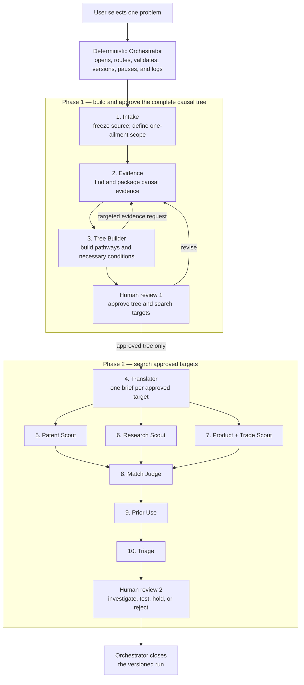
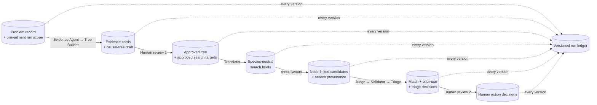

# Welfare Technology Scanner — Product Requirements Document

**Status:** PRD draft for design review

**Scope:** MVP process and information model; no software implementation

**Canonical inputs:** `PROCESS_MAP.md`, then `PROCESS_SPEC.md`, then the problem
register workbook. This PRD resolves inconsistencies among them. Imported dashboard
and chat artifacts are historical context only.

**Relationship to the Agent Commons:** This scanner is the proposed **deep causal
scanning** profile within Track A. It complements rather than replaces the current
**broad capability mapping** profile, which also maps measurement and
implementation bottlenecks. Broad mapping may hand one selected causal component
to this workflow for deeper decomposition. Both profiles remain valid while the
product direction is being explored.

## 1. Product decision

The scanner takes one user-selected farm-animal welfare ailment, constructs an
evidence-backed map of the accepted and unresolved causal routes to that ailment,
identifies the necessary conditions within each accepted route, and searches for
existing technologies that could remove an approved condition.

### The MVP in six steps

1. The user selects one problem. Intake freezes that record and defines one
   ailment as the run scope when the row bundles more than one harm.
2. The Evidence Agent and Tree Builder loop until they have a complete-enough
   draft of pathways, necessary conditions, and unresolved hypotheses.
3. Human Reviewer 1 approves the complete tree and chooses the condition nodes
   that are valid technology-search targets.
4. The Translator turns each approved target into a species-neutral search
   brief; three scouts search patents, research, and product/trade sources.
5. The Match Judge, Prior-Use Validator, and Triage Agent filter and rank every
   candidate while keeping it attached to its exact target and pathway.
6. Human Reviewer 2 chooses whether to investigate, test, hold, or reject each
   candidate. The Orchestrator records the whole run.

The MVP optimises for **a clear, traceable flow**, not a perfect or exhaustive
scientific model. It must still be possible to answer, for every technology
candidate:

1. Which exact condition and pathway does it target?
2. Why is that condition considered necessary within that scope?
3. What evidence supports or contradicts the claim?
4. What was searched, where, and when?
5. What did each model and each human decide?

## 2. Verdict on the current mental model

**Verdict: coherent after four small clarifications.** The overall two-phase design,
role boundaries, two human decisions, and “build the tree before searching” rule
are sound. The following clarifications are required for internal consistency.

1. **The workbook selects the problem; it does not validate the mechanism.** A
   workbook row is frozen as provenance. Its mechanism wording and confidence
   are hypotheses for evidence review, not accepted causal claims. This matters
   for `BRO-02`, whose row says “ammoniacal moisture” even though ammonia is not
   established as necessary for broiler footpad dermatitis.
2. **A pathway and a necessary condition are different objects.** Alternative
   pathways are possible routes to a parent outcome. They are not individually
   necessary when another route can produce the same outcome.
3. **A search target is a derived search-layer object.** It references one
   approved condition; it is not a duplicate causal claim and cannot exist
   without the condition and pathway it targets.
4. **Boolean trees must not disguise continuous or cumulative mechanisms.** For
   example, litter wetness is a stock affected by inputs and outputs. “Water
   enters” plus “water is not removed fast enough” is a useful engineering frame,
   but not automatically an evidence-backed `ALL` decomposition. If no
   defensible necessity claim exists below “damaging litter wetness,” the branch
   stops there.

## 3. Goals and non-goals

### MVP goals

- Process one selected ailment deeply in a versioned run.
- Keep sourced claims, model inferences, unresolved hypotheses, and human
  decisions visibly separate.
- Build and approve the complete causal tree before full technology search.
- Search patents, research, products, and trade sources against approved,
  changeable, technically distinct necessary conditions.
- Preserve exact query, source, date, coverage, and candidate-to-condition
  provenance.
- Produce a ranked, auditable shortlist for human investigation.

### MVP non-goals

- Discover or curate new welfare problems outside the 33-row register.
- Model contributory risk factors as though they were necessary conditions.
- Prove that the causal tree is exhaustive.
- Estimate population-level welfare impact from route logic alone.
- Prove novelty or patentability.
- Recommend autonomous on-farm deployment.
- Run a live search while the causal tree is still changing.

## 4. Canonical terminology and information model

| Object | Meaning | Key rule |
|---|---|---|
| **Problem record** | One immutable row from the controlled 33-row register. | Inventory and provenance only; its mechanism field is not evidence. |
| **Ailment node** | The single welfare harm in scope for a run. | If a row bundles harms, the run records a narrower subject without altering the source row. |
| **Pathway node** | One causally distinct route by which a parent ailment or condition may arise. | Sibling pathways are alternatives; one pathway need not be necessary for the ailment. |
| **Condition node** | A physical, biological, environmental, or operational state claimed to be necessary for a stated parent process or pathway. | Its scope is explicit and it must pass the counterfactual test below. |
| **Hypothesis node** | A proposed pathway, condition, edge, or gate whose support is below the MVP acceptance threshold. | Preserved with the missing evidence; excluded from first-pass technology search. |
| **Search-target node** | A search-layer object that references one approved condition and one pathway. | Created only when the condition is changeable and adds a distinct search surface. |
| **Candidate technology** | An existing patent, prototype, product, material, or process that may act on one search target. | Remains linked to that target and pathway throughout evaluation. |

`Strong` and `Plausible` are evidence markers on an **accepted necessity claim**,
not general labels that make an entire node or source true.

- **Strong:** necessity within the stated scope is directly supported by good
  empirical evidence or a credible synthesis.
- **Plausible:** necessity is a source-grounded mechanistic inference with
  indirect, limited, or mixed evidence.
- Anything below Plausible is **Unresolved**. `Unresolved` is a workflow state,
  not a weaker accepted evidence marker.

### Necessary-condition test

Before accepting `child is necessary for parent within pathway P`, the Tree
Builder must answer:

> If the child condition were absent while the rest of pathway P remained as
> specified, could the parent process still occur through pathway P?

- If **no**, the child may be necessary within that scope.
- If **yes**, it is contributory, protective, or one alternative route; it is
  not a necessary condition.
- If the answer depends on an unstated threshold, time window, population, or
  route definition, the claim must be narrowed before acceptance.

### Logical representation

- `ANY` joins alternative **pathway nodes**. It does not turn each alternative
  into a necessary condition.
- `ALL` joins conditions that are each necessary within one explicitly named
  pathway or parent process.
- Gates are logical connectors, not scientific evidence. Every edge and gate
  still needs a rationale and citations.
- The known pathway set may be incomplete. “No other supported pathway was
  found in this search” must not be rendered as “no other pathway exists.”
- Continuous, threshold, cumulative-dose, and feedback mechanisms should remain
  as one accurately worded condition unless an evidence-backed scoped
  decomposition is available. The MVP does not force them into `ALL`/`ANY`.

Removing a necessary condition supports only the claim **“this route is
blocked.”** It does not support **“the ailment is eliminated”** or **“suffering
falls materially”** without route prevalence, coverage, effect-size, and
compensating-effect evidence.

## 5. Visual 1 — agent and orchestration flow



The Orchestrator validates schemas, routes artifacts, applies limits and retry
rules, and pauses for people. It does not repair scientific content, choose a
gate, promote a hypothesis, judge novelty, or overwrite a human decision.

The three scout roles may run in parallel only after Human Review 1 approves a
specific causal-tree version and its target set.

## 6. Visual 2 — structured artifact and data flow



Every artifact has an immutable ID, schema version, producing role, timestamp,
input artifact IDs and content hashes. New evidence or a revision creates a new
version; it never silently changes an approved artifact.

### Minimum artifact contracts

| Artifact | Required content |
|---|---|
| `RunSubject` | run ID; source problem ID and version; one ailment; species/system/stage; inclusions; exclusions; narrowing rationale |
| `EvidenceRequest` | question ID; exact claim, edge, gate, or branch decision at issue; population and pathway scope; preferred evidence; stopping limit |
| `EvidenceCard` | one claim; supporting, contradicting, or inconclusive status; quoted or precisely located source passage; citation; study context; retrieval query/date; coverage limits; inference boundary |
| `CausalTreeDraft` | typed nodes and edges; logical gates; necessity scopes; evidence-card IDs; Strong/Plausible markers; unresolved items; terminal stopping records |
| `MechanismReviewDecision` | reviewer; reviewed tree hash; per-edit rationale; approved/revise/reject; approved target IDs |
| `SearchTarget` | target ID; exact condition ID; pathway ID; changeability rationale; technical-distinctness rationale; exclusions; reviewer approval |
| `MechanismSearchBrief` | target ID; species-neutral mechanism; faithful variants; synonyms; adjacent fields; explicit exclusions; no broadened causal claim |
| `CandidateRecord` | candidate ID; target and pathway IDs; source type; exact source/date; relevant passage or claim; query provenance; scout abstentions |
| `MatchDecision` | candidate ID; keep/weak/reject; exact action on condition; context and scale compatibility; missing evidence; no scout ranking |
| `PriorUseFinding` | candidate ID; dated queries and sources; already used/tested elsewhere/failed/apparently untested/unknown; contrary evidence; confidence |
| `TriageList` | component scores; uncertainties; route-level benefit claim; readiness; cost; scale; reversibility; adoption barriers; new-harm risks; next test |
| `ActionReviewDecision` | reviewed shortlist hash; investigate/test/hold/reject per candidate; rationale; owner and optional next action |

## 7. Branch construction and stopping rules

The Welfare Evidence Agent owns retrieval. The Fault-Tree Builder owns tree
structure, logical scope, and branch depth. They communicate only through
versioned requests and evidence cards routed by the Orchestrator.

For each proposed condition or pathway, the Tree Builder must record:

1. the precise parent and pathway scope;
2. the counterfactual necessity result;
3. the supporting and contradicting evidence-card IDs;
4. the accepted marker or unresolved state;
5. whether the node is changeable without predictable replacement harm;
6. whether deeper decomposition is expected to expose a different physical
   target, vocabulary, technical field, or intervention family; and
7. `continue`, `search-equivalent`, `actionable-now`,
   `insufficient-evidence`, `immutable`, or `replacement-harm`.

The MVP uses Tree Builder judgement for item 6. It records a short rationale and
Strong/Plausible confidence in that stopping judgement; it does not run a probe
technology search.

### Search-target eligibility

A SearchTarget may be created only when all are true:

- it references an accepted necessary ConditionNode, never an ailment, pathway,
  gate, contributory factor, or unresolved hypothesis;
- the necessity claim is Strong or Plausible and retains its stated scope;
- the condition is changeable in principle in the target system;
- acting on it does not predictably replace the original harm with another
  material welfare harm; and
- it adds a technically distinct search surface compared with already approved
  targets.

Intermediate and terminal conditions are equally eligible. A terminal condition
is not searched merely because it is a leaf, and an intermediate condition is
not skipped merely because it has children.

## 8. Visual 3 — broiler footpad dermatitis worked example

This is a deliberately simple process fixture, not an expert-approved or
complete scientific map. Its job is to show what the workflow may produce and
which boxes would be searched, not to settle broiler pathology. It narrows
workbook row `BRO-02` from the bundled “footpad dermatitis and hock burn”
wording to **broiler footpad dermatitis only**. The workbook row remains
unchanged as source provenance.

```mermaid
flowchart TD
    A([AILMENT<br/>Broiler footpad dermatitis])
    G1{{ANY: alternative proposed pathways<br/>known set may be incomplete}}

    P1[[ACCEPTED PATHWAY<br/>Wet-litter contact damage]]
    H1[/UNRESOLVED HYPOTHESIS<br/>Ammonia-mediated chemical irritation/]
    H2[/UNRESOLVED HYPOTHESIS<br/>Independent mechanical pressure or abrasion/]

    G2{{ALL within the wet-contact pathway}}
    C1[CONDITION N1 — Strong<br/>Damaging moisture state exists<br/>at the litter-footpad interface]
    C2[CONDITION N2 — Plausible<br/>That moisture is transferred to<br/>footpad tissue through litter contact]
    C3[CONDITION N3 — Plausible<br/>Cumulative exposure exceeds<br/>the tissue-damage threshold]

    T1>SEARCH TARGET T1<br/>Control damaging moisture accumulation]
    T2>SEARCH TARGET T2<br/>Prevent contact or moisture transfer]
    T3>SEARCH TARGET T3<br/>Reduce cumulative exposure or increase recovery]

    U1[/UNRESOLVED LOWER-LEVEL ROUTES<br/>Wet droppings; drinker leakage; condensation;<br/>insufficient evaporation, drainage, absorption, or removal/]

    A --> G1
    G1 --> P1
    G1 -. not accepted .-> H1
    G1 -. not accepted .-> H2
    P1 --> G2
    G2 --> C1
    G2 --> C2
    G2 --> C3

    C1 -. targeted by .-> T1
    C2 -. targeted by .-> T2
    C3 -. targeted by .-> T3
    C1 -. do not mislabel alternatives as necessary .-> U1
```



### Worked-example decisions

| Item | Decision | Reason |
|---|---|---|
| Wet-litter contact pathway | Accepted for the fixture | Broilers on wetter litter developed earlier and more severe lesions; moving affected birds to drier litter suppressed or delayed progression. This supports a wet-contact route, not global necessity for every FPD case. |
| N1: damaging interface moisture | Accepted; **Strong** | Direct broiler evidence and the EFSA synthesis support high litter moisture as a major causal hazard within this route. |
| N2: transfer through litter contact | Accepted; **Plausible** | It is mechanistically required by the deliberately scoped contact pathway and is consistent with evidence on time standing on litter and elevated resting areas. Direct isolation of this condition is limited. |
| N3: cumulative exposure exceeds tissue tolerance | Accepted; **Plausible** | Duration and repeated exposure matter, but intensity and time can compensate for one another. Keep this as one dose condition; do not assert that one fixed duration is universally necessary. |
| Ammonia-mediated irritation | Unresolved | Ammonia may be harmful in barns, but the current evidence does not establish it as necessary for FPD. A controlled turkey study found wet litter worsened lesions while added ammonia did not worsen them beyond wetness alone. No ammonia or urease search in the first pass. |
| Independent mechanical pathway | Unresolved | Floor/litter quality and time standing are hazards, but that does not establish abrasion or pressure as an independent sufficient route. It needs a pathway-specific evidence request. |
| Wet droppings, leaks, condensation | Alternative lower-level routes, unresolved in this fixture | Each can contribute to wetness, but no single one is necessary for damaging litter wetness. They become accepted pathway nodes only if evidence supports a scoped route with its own necessary conditions. |
| “Water enters” AND “water is not removed fast enough” | Not accepted as the current decomposition | It restates a stock/flow balance and can be temporally false for already-wet litter. Search the accurately scoped wetness condition until evidence justifies distinct route-specific children. |

The three proposed search targets are therefore **T1, T2, and T3 only**. No
technology search is launched for the ailment label, the wet-contact pathway
label, ammonia, urease, abrasion, pressure, wet droppings, leaking drinkers, or
condensation in this fixture.

### Species-neutral search briefs for the approved targets

| Target | Brief |
|---|---|
| T1 | Control damaging liquid accumulation at a loaded biological contact surface made of porous organic material. Include input reduction, sensing, absorption, drainage, wicking, evaporation, and physical removal; exclude technologies whose only claimed action is ammonia control. |
| T2 | Prevent or interrupt liquid transfer from a wet, abrasive substrate to vulnerable tissue at group scale without materially restricting normal movement. |
| T3 | Reduce cumulative damaging surface-exposure dose, or increase safe recovery intervals, in a continuously occupied group environment. |

Candidate technologies remain attached to T1, T2, or T3 and inherit the
wet-litter pathway scope. Even a strong match may block only that pathway.

Primary evidence used to calibrate the fixture:

- [EFSA Panel on Animal Health and Welfare, 2023](https://efsa.onlinelibrary.wiley.com/doi/10.2903/j.efsa.2023.7788)
- [Taira et al., 2014](https://pubmed.ncbi.nlm.nih.gov/24366153/)
- [Wang et al., 1998](https://pubmed.ncbi.nlm.nih.gov/9649870/)
- [Youssef et al., 2011](https://pubmed.ncbi.nlm.nih.gov/21500636/)

## 9. Required workflow states and failure behaviour

```text
DRAFT_SCOPE
  -> BUILDING_CAUSAL_TREE
  -> AWAITING_MECHANISM_REVIEW
  -> BUILDING_CAUSAL_TREE          (review requests revision)
  -> CAUSAL_TREE_APPROVED
  -> SEARCHING
  -> VALIDATING_AND_TRIAGING
  -> AWAITING_ACTION_REVIEW
  -> CLOSED

Any active state -> STOPPED_LIMIT | STOPPED_ERROR | CANCELLED
```

- A timeout or unavailable source creates a logged coverage warning; it does not
  become negative evidence.
- Malformed model output is rejected and may be retried without silent repair of
  scientific content.
- Conflicting evidence is preserved on the same claim and surfaced to Human
  Review 1.
- If a required citation is missing after the evidence loop, the claim becomes
  unresolved.
- If Human Review 1 changes the approved tree after searching begins, the old
  target set and dependent search artifacts become superseded; affected searches
  must be regenerated from a new approved version.
- Duplicate candidates from different scouts are merged by identity while all
  discovery paths and queries remain attached.
- “Apparently untested” always records the search date, systems, queries, and
  coverage limits. It never means novel.

## 10. MVP acceptance criteria

The PRD is ready to become implementation tickets when the following can be
expressed as deterministic contracts and test fixtures:

1. A run cannot start without one approved problem ID and one ailment scope.
2. The original workbook row remains immutable and distinguishable from the
   validated causal tree.
3. Every causal node is typed; every necessity claim names its parent and
   pathway scope.
4. A contributory factor that fails the counterfactual test cannot be stored as
   an accepted necessary condition.
5. Every accepted necessity claim has evidence-card links and a Strong or
   Plausible marker.
6. Every unresolved item states what evidence would be needed to reopen it.
7. Every terminal branch has one valid stopping code and rationale.
8. Searches cannot start before Human Review 1 approves an exact tree version
   and target set.
9. Every SearchTarget references one accepted, changeable, technically distinct
   condition and its pathway.
10. Every candidate, match decision, prior-use finding, score, and human action
    traces back to the same target and pathway.
11. The `BRO-02` fixture produces T1–T3 and excludes ammonia and urease.
12. The known-solution backtests (`BRO-05`, `SHR-01`, and `SHR-02`) recover the
    known intervention through a reviewable evidence and target path.
13. The system can abstain cleanly when evidence or search coverage is
    insufficient.

## 11. Deferred decisions

- How compound register rows should be handled permanently: permit run-level
  narrowing, or curate the register into one ailment per stable ID.
- Whether a later version adds contributory-factor layers and quantitative or
  threshold gates.
- Whether later versions estimate route prevalence and population-level welfare
  effect.
- Whether ambiguous stopping decisions may use a small searchability probe.
