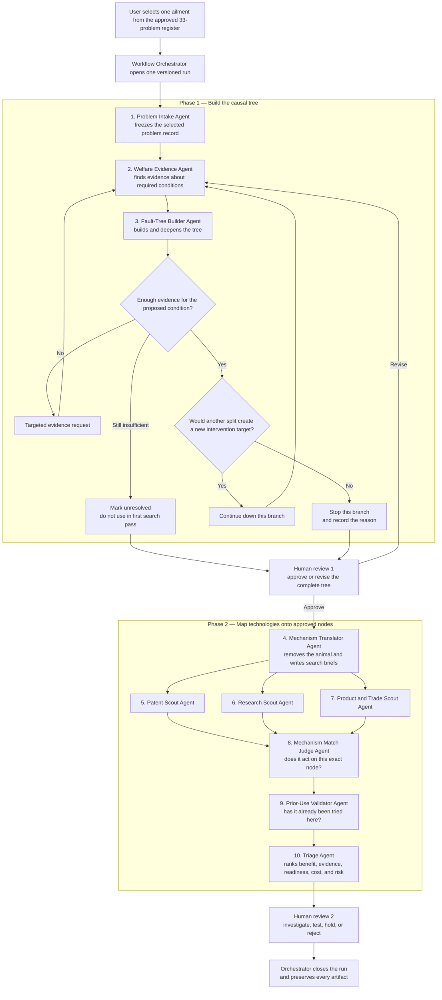
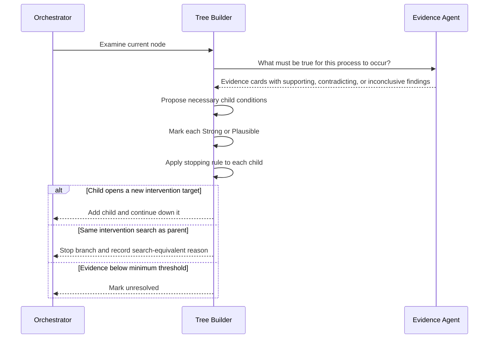
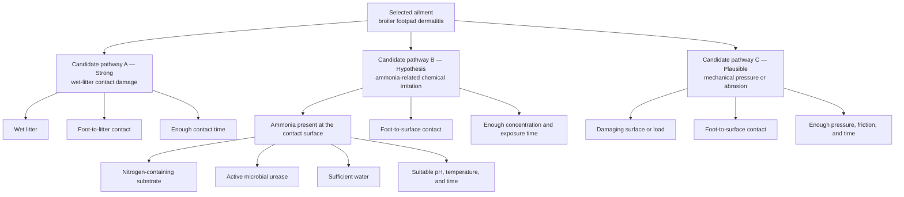
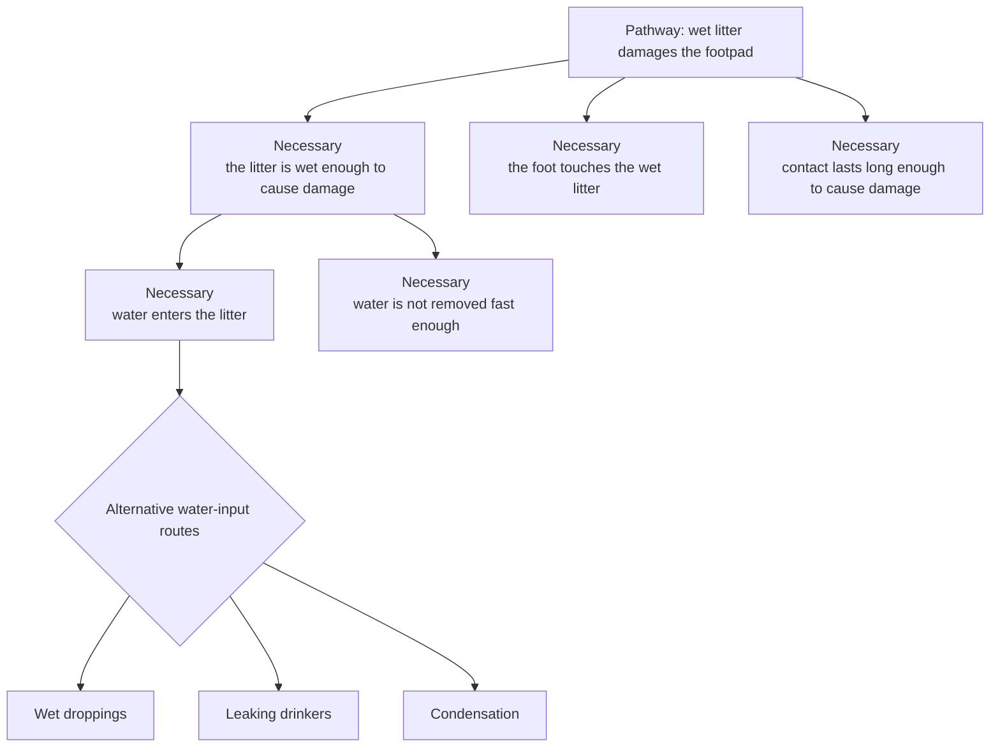
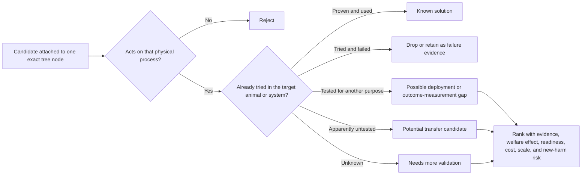

# Welfare Technology Scanner — Clear Process Map

## The idea in one sentence

Choose one documented welfare problem, build an evidence-backed tree of the
conditions required for each causal pathway, stop each branch when more detail
would not expose a new intervention target, and then search other fields for
technologies that can remove one of those conditions.

## Five terms used throughout

1. **Ailment** — the selected welfare harm, such as broiler footpad dermatitis.
2. **Causal pathway** — one way that the ailment can occur, such as damage from
   prolonged contact with wet litter.
3. **Necessary condition** — something that must be present for that particular
   pathway or parent process to occur.
4. **Searchable node** — a condition that describes a distinct intervention
   target and therefore merits its own technology search.
5. **Candidate technology** — an existing patent, research prototype, product,
   material, or process that may remove or control a searchable condition.

“Necessary” is scoped to its parent or pathway. Removing a necessary condition
blocks that pathway. It does not automatically eliminate the whole ailment if a
different causal pathway remains.

## The full process



The tree is completed before full technology searches begin. This prevents an
easy-to-find technology from biasing the causal model and avoids searching
branches that may later be removed.

## How one branch grows

For the current node, the two agents repeat this exchange:



This is a structured exchange, not an open-ended chat. The Evidence Agent owns
retrieval. The Tree Builder owns structure and stopping decisions. Model memory
may suggest a question, but it cannot serve as evidence.

## The stopping rule

The main question is:

> Would going one level deeper expose a meaningfully different physical target,
> technical field, search vocabulary, or family of interventions?

For the MVP, the Tree Builder answers this using the LLM's judgement. It records
the expected difference, a short rationale, and a Strong or Plausible marker.
No separate technology probe is required. The human tree reviewer can reopen a
branch if the stopping judgement looks weak or premature.

- **Yes:** add the supported child and continue down that branch.
- **No:** stop at the current node and search it later.
- **Not enough evidence:** request targeted evidence; if still insufficient,
  mark the branch unresolved.

Other reasons to stop are that the condition is not changeable, changing it
would create another material welfare harm, or the current node is already a
specific actionable physical process.

There is no fixed tree depth. One branch may stop after one split while another
continues for several levels.

## What data moves between the roles

| From | Artifact handed on | To |
|---|---|---|
| User | One selected problem ID | Orchestrator |
| Problem Intake Agent | Frozen problem record | Evidence Agent |
| Evidence Agent | Claim-level evidence cards with citations, confidence, and search coverage | Tree Builder |
| Tree Builder | Targeted causal question when evidence is missing | Evidence Agent, via Orchestrator |
| Tree Builder | Draft tree with node types, evidence markers, and a stopping reason on every terminal node | Human reviewer 1 |
| Human reviewer 1 | Approve, revise, or reject decision artifact | Orchestrator |
| Mechanism Translator | Species-neutral search brief for each approved search target | Three Scout Agents |
| Patent, Research, and Product Scouts | Node-linked candidate records with source and query provenance | Match Judge |
| Match Judge | Keep, weak match, or reject decision for each candidate | Prior-Use Validator |
| Prior-Use Validator | Already used, tested elsewhere, failed, apparently untested, or unknown classification | Triage Agent |
| Triage Agent | Ranked shortlist with component scores, uncertainties, and proposed next test | Human reviewer 2 |
| Human reviewer 2 | Investigate, test, hold, or reject decision | Orchestrator |
| Orchestrator | Complete versioned run ledger linking every artifact and decision | User |

## Worked example — broiler footpad dermatitis

This example uses the footpad-dermatitis component of problem `BRO-02`. It is a
simple illustration of the method, not a completed expert-approved causal
model.

### Step 1 — Select and freeze the ailment

```text
Selected problem: BRO-02
Ailment in scope: painful footpad dermatitis in broiler chickens
Initial source family: EFSA broiler-welfare review and cited studies
```

The pipeline does not invent a different problem or silently widen the run.

### Step 2 — Propose several causal pathways, then test them

The Tree Builder may initially propose several pathways. The Evidence Agent then
tests what is required for each pathway and how well it is supported.



This is a **candidate map**, not three accepted truths:

- **Pathway A — wet-litter contact damage:** strongest initial support. Studies
  show substantially worse lesions with wet litter and improvement after moving
  birds to drier litter.
- **Pathway B — ammonia-related irritation:** included because it is a common
  hypothesis and it demonstrates the proposed ammonia branch. Its internal
  ammonia-production chain is chemically coherent, but the current evidence
  does not establish ammonia as necessary for footpad dermatitis. In one
  controlled turkey study, adding ammonia did not worsen lesions beyond wet
  litter alone. Under the necessary-only MVP, this branch is marked unresolved
  rather than sent to technology search.
- **Pathway C — mechanical pressure or abrasion:** plausible for a specifically
  defined surface-contact route. EFSA identifies floor or litter quality and
  time standing on the surface as hazards for foot lesions, but the exact
  necessity claims still require expert review.

The pathways may interact and are not claimed to be exhaustive. The point of
the evidence loop is to prevent every plausible-looking branch from entering
the approved necessary-condition tree.

### Which nodes are necessary conditions, and which get searched?

The diagram contains different node types:

| Node type | Example | Is it a necessary condition? | Technology search in the necessary-only MVP? |
|---|---|---|---|
| Ailment | Broiler footpad dermatitis | No. It is the harm to explain. | The broad harm can inform context, but it is not the main mechanism search target. |
| Causal pathway | Wet-litter contact damage | No. It is one possible route to the harm. | No in the necessary-only MVP. It organises the conditions beneath it. |
| Approved condition within a pathway | Wet litter; foot contact; enough contact time | Yes, for that pathway or parent process. | Yes, if the condition is technically distinct and changeable. |
| Deeper approved condition | Water enters litter; water is not removed fast enough | Yes, for the wet-litter parent node. | Yes, when it opens a different intervention search. |
| Hypothesis or unresolved node | Ammonia-mediated irritation under current evidence | Not yet accepted as necessary. | No in the first pass. Preserve it with the reason and evidence needed to reopen it. |

The technology scouts therefore do **not** search every box indiscriminately.
They receive a list of approved search targets from the reviewed tree. A node is
eligible only when it is:

1. accepted as necessary for its parent process or pathway;
2. supported at least at the Plausible level;
3. changeable in principle; and
4. expected to expose a distinct intervention target compared with its parent.

Both intermediate and terminal nodes may qualify. The candidate is always
attached to the exact node and pathway it targets, so the system never implies
that blocking one route necessarily eliminates the entire ailment.

### Step 3 — Find the necessary conditions within that pathway

After the initial evidence check, the strongest pathway is decomposed first:



Read the diagram in plain English:

- For this pathway to occur, **all three** top conditions are required: wet
  litter, physical contact, and enough contact time.
- Wet litter requires water to enter faster than it is removed.
- Wet droppings, leaking drinkers, and condensation are **alternative ways**
  for water to enter. No single one is required in every case, so each becomes
  its own possible sub-pathway rather than being labelled globally necessary.

Each edge has citations, a short rationale, and one simple marker:

- **Strong** — directly supported by good empirical evidence or a credible
  synthesis.
- **Plausible** — a source-grounded mechanistic inference with indirect,
  limited, or mixed evidence.

Anything weaker remains unresolved and is not searched in the first pass.

### Step 4 — Apply the stopping rule

| Current node | Proposed deeper split | Decision | Why |
|---|---|---|---|
| Wet litter | Water enters and is not removed fast enough | Continue | Water input and water removal expose different intervention targets. |
| Water enters litter | Wet droppings, leaking drinkers, or condensation | Continue as separate routes | They lead to nutrition, drinker-engineering, and building-climate searches. |
| Water is not removed fast enough | Drying, drainage, absorption, and physical removal | Continue if evidence supports the split | These may lead to different technical fields. |
| Evaporation is too slow | Molecular interactions of individual water molecules | Stop | The extra detail is unlikely to change the drying technologies searched. |

The output of Phase 1 is an approved causal tree with a stopping reason on every
terminal node.

The ammonia hypothesis is still visible in the run record, along with the
evidence that prevented it from entering the necessary-condition search tree.
If better evidence later supports a precisely defined ammonia-mediated pathway,
the reviewer can reopen and decompose it. Only then would microbial urease
become an eligible node for searches such as urease-inhibition technologies.

### Step 5 — Turn approved nodes into technology-search briefs

The Mechanism Translator removes the chicken-specific wording without changing
the mechanism:

| Tree node | Species-neutral search brief |
|---|---|
| Moisture retained in litter | Control liquid accumulation in loaded porous organic material. |
| Foot-to-litter contact | Separate vulnerable tissue from a wet, abrasive substrate at group scale. |
| Prolonged exposure | Reduce continuous contact time with a damaging surface without restricting normal movement. |

### Step 6 — Search three source families in parallel

For every distinct approved node:

- the **Patent Scout** searches patent families, claims, classifications, and
  citations;
- the **Research Scout** searches engineering, materials, biomedical,
  environmental, and agricultural research; and
- the **Product and Trade Scout** searches products, manufacturers, standards,
  technical reports, regulatory material, and trade publications.

Illustrative technology families for the retained-moisture node might include
absorbent materials, passive drainage, wicking structures, or active drying.
These are search directions, not validated recommendations.

### Step 7 — Filter and rank candidates



“Apparently untested” is always a dated search result, not proof of novelty.

### Step 8 — Human action decision

The final human reviewer sees:

- the exact pathway and condition the technology targets;
- how strongly that condition is supported;
- the evidence and queries used to find the candidate;
- prior use, contradictory evidence, and uncertainty;
- expected route-level welfare effect and possible new harms; and
- the proposed next action: investigate, test, hold, or reject.

No agent autonomously recommends on-farm deployment.

## Exact system count

- **10 LLM roles**: Intake, Evidence, Tree Builder, Translator, Patent Scout,
  Research Scout, Product and Trade Scout, Match Judge, Prior-Use Validator,
  and Triage.
- **1 deterministic Workflow Orchestrator**: routes work, validates schemas,
  preserves versions, handles retries and limits, and pauses for people. It
  makes no scientific judgements.
- **2 human review points**: approve the causal tree; decide what action to take
  on the final candidates.

## Initial problem source and limits

The 33-row workbook in this folder is the authoritative problem inventory for
the MVP. The underlying scientific sources—not the spreadsheet or an LLM—remain
the authority for causal claims. Adding new ailments is a separate future
curation workflow.

Evidence used for this example:

- [EFSA 2023 broiler-welfare opinion](https://efsa.onlinelibrary.wiley.com/doi/10.2903/j.efsa.2023.7788)
- [Taira et al. 2014 broiler wet-litter study](https://www.jstage.jst.go.jp/article/jvms/76/4/76_13-0321/_article)
- [Wang et al. 1998 chicken litter-moisture study](https://pubmed.ncbi.nlm.nih.gov/9649870/)
- [Youssef et al. 2011 controlled litter-moisture, ammonia, and uric-acid study](https://pubmed.ncbi.nlm.nih.gov/21500636/)
