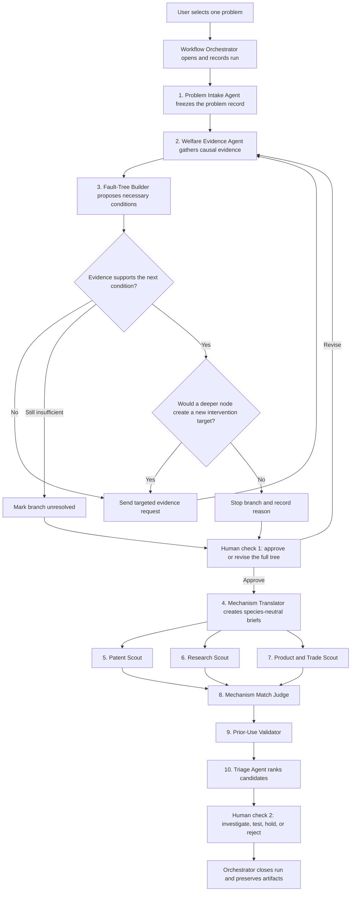
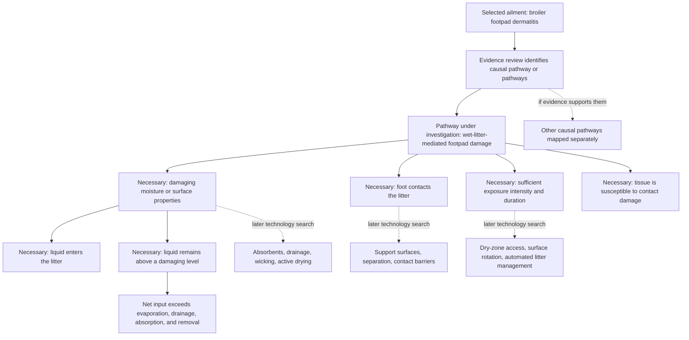

# Welfare Technology Scanner — Process Specification

## 1. Purpose

The scanner starts with a documented farm-animal welfare harm and looks for
technologies from other fields that could interrupt the physical process causing
it.

The scanner does **not** decide that a mechanism is true, a technology is novel,
or an intervention is safe merely because an AI agent says so. It preserves the
evidence and uncertainty needed for a qualified person to make those decisions.

## 2. The process at a glance



This is **10 LLM roles, 1 deterministic workflow orchestrator, and 2 human
decision points**. The three search roles run in parallel. In an early
implementation, one model can perform several LLM roles in separate, logged
runs; they are separate roles because they have different inputs, success
criteria, and failure modes.

### Run scope

One run processes **one problem selected by the user** from the approved
register. The pipeline goes deeply into that problem, decomposing each causal
route independently until the stopping rule is met. It does not batch all 33
problems or trade depth on the selected problem for broader coverage.

## 3. Where welfare problems come from

Problems enter through a curated problem register, not through free-form agent
invention. Each entry must include:

- stable problem ID;
- species and production stage or system;
- welfare harm in plain language;
- current best physical-mechanism description;
- scale and duration, clearly marked when approximate;
- current mitigations and their limitations;
- economic or adoption constraints;
- source citations; and
- mechanism confidence.

The initial register is the 33-row workbook in this folder. It is the
**authoritative inventory for the MVP**: a run must start from one of its stable
problem IDs. It contains 33 unique IDs with no missing species, stage, problem,
mechanism, source, or confidence fields. Twenty-six mechanism descriptions are
marked high confidence and seven medium confidence.

Its source families include EFSA welfare opinions, the Norwegian Fish Health
Report, FISHWELL, Shrimp Welfare Project and Rethink Priorities reports, and the
fair-fish database. The register is not itself the scientific source of truth
for a causal claim. Some citations are abbreviated, several figures are
approximate, and medium-confidence mechanisms explicitly require review. The
Welfare Evidence Agent must trace the underlying sources before a tree is
approved.

Adding or revising problem records is a separate, versioned curation workflow,
outside the first scanner pipeline. This prevents an agent from changing the
problem universe during a run while leaving room to expand the register later.

## 4. Fault-tree rules

### Node types

Every node is one of:

- **Harm:** the welfare outcome being prevented.
- **Condition:** a physical, biological, environmental, or operational state
  that contributes to its parent.
- **Constraint:** a branch that cannot currently be changed, or should not be
  changed because doing so creates another material harm.

The first implementation records only:

- **necessary:** within the causal route being described, the parent cannot
  occur without it. This carries one of two simple evidence markers:
  - **strong:** necessity is directly supported by good empirical evidence or
    a credible synthesis; or
  - **plausible:** necessity is a source-grounded mechanistic inference, but the
    evidence is indirect, limited, or mixed; or
- **unresolved:** necessity is not established strongly enough to use the node
  in the initial search pipeline.

Contributory factors are valuable, but they are deferred from the first version
so the tree has one clear meaning. They can be added later as a separate layer.

### Gates

- **ALL:** all child conditions are necessary within this causal route.
  Interrupting one child is enough to break that route.
- **ANY:** children represent alternative causal routes. Breaking one route
  does not prevent harm through the others.
- **UNRESOLVED:** evidence is insufficient to defend ALL or ANY. The pipeline
  may continue for discovery, but downstream claims must remain conditional.

A risk factor must not be called necessary merely to create a tidy tree.
Plausible nodes need at least a source-grounded mechanism and a stated
inference; model memory alone is below the minimum threshold. Each gate and
causal edge carries citations, one of the two evidence markers, and a short
rationale. Anything below “plausible” is labelled unresolved and kept out of
the first search pass.

### Branch-by-branch stopping rule

The product designers define and version this rule in advance; it is not
invented separately for each welfare problem. During a run, the Fault-Tree
Builder Agent explores the evidence-backed tree recursively and applies the
rule to each branch. It proposes the branches, the depth, and a coded stopping
reason for every terminal node.

The Workflow Orchestrator checks only that every terminal node has a valid
stopping record. It does not decide whether the scientific judgement is right.
The first human reviewer approves or changes disputed branches and stopping
decisions before any search begins.

Stop splitting a branch when **any** of these is true:

1. A further split would use substantially the same search language,
   engineering field, and intervention class as the current node.
2. The current node is already a specific, changeable physical process that a
   technology could act on.
3. Available evidence does not support a more detailed causal claim.
4. The remaining branch is not changeable in the target system.
5. Changing the branch would predictably replace the original harm with another
   material welfare harm.

Continue splitting when a child would lead to a meaningfully different search
field or intervention. Apply this test separately to every branch; trees do not
need to be symmetrical.

The primary test is **marginal intervention-search value**. For the current node
and each proposed child, the Tree Builder sketches:

- the physical process a technology would need to change;
- the likely terminology and technical fields to search; and
- the broad intervention families that might act on it.

Continue downward if the child opens at least one credible intervention target,
technical field, or search vocabulary not already covered by the parent. Stop
if the child merely explains the same process at greater biological or chemical
detail while pointing to the same searches and intervention families.

This is not a claim that no further scientific information exists. It means
further detail has no expected value for this pipeline's purpose: discovering
different ways to intervene. The later Mechanism Translator formalises the
queries, and the human reviewer can reopen a branch if the Tree Builder stopped
too early.

Example: continue from “wet litter” to “liquid retained in porous organic
material,” because that opens absorbent-material, drainage, and active-drying
searches. Stop before decomposing water retention into molecular hydrogen-bond
interactions if that would still produce the same moisture-control searches.

There is no fixed depth target. A branch may stop after one split while another
continues for several levels. The Tree Builder records the stopping reason on
every terminal node so a reviewer can tell whether it stopped for search
equivalence, actionability, weak evidence, immutability, or risk of replacement
harm.

### Evidence loop while building the tree

The Fault-Tree Builder does not conduct an independent, unlogged literature
search. It reasons over evidence cards supplied by the Welfare Evidence Agent.
When it cannot justify a causal edge, necessity claim, gate, or stopping
decision, it sends a structured evidence request back through the orchestrator.

The Welfare Evidence Agent then performs the targeted retrieval and returns new
evidence cards, including negative or inconclusive findings. The Tree Builder
revises the affected branch. The orchestrator repeats this loop until the branch
has enough evidence to proceed, the stopping rule is satisfied, or the evidence
remains insufficient and the branch is marked unresolved. This keeps retrieval
separate from causal judgement while still allowing the tree to grow deeply.

### What the Tree Builder's own intelligence may do

The Tree Builder uses the LLM's reasoning ability to organise evidence, propose
candidate child nodes, compare technical fields, and apply the stopping rubric.
Its built-in or remembered knowledge may suggest a hypothesis or a targeted
question, but it is never treated as evidence for a causal edge or necessity
claim.

For every branch, the agent must answer in structured form:

1. What evidence says this child is necessary within this route?
2. Is the child a more specific, changeable physical process?
3. Would searching the child use materially different terminology, expertise,
   or intervention classes from searching the parent?
4. Would interrupting the child block this route, rather than merely reduce its
   probability?
5. Which stopping code applies: continue, search-equivalent, actionable-now,
   insufficient-evidence, immutable, or replacement-harm?

The agent's answer is a reviewable proposal, not a fact. A missing citation
causes an evidence request or an unresolved label; it cannot be filled from
model memory. The first human checkpoint can approve both strong and plausible
nodes for downstream search, but the marker stays visible throughout the run.

### Which nodes get searched

Search every approved necessary-condition node whose technical field or likely
intervention class differs materially from its parent. Do not search the ailment
or causal-pathway labels in the necessary-only MVP, and do not search only the
leaves. Each search target must state which causal pathway it belongs to and why
it adds a distinct search surface.

Candidate technologies are attached to the exact node they act on. A terminal
node may have several candidates, an intermediate node may have candidates of
its own, and some nodes may have none. The result is therefore one causal tree
with node-level candidate sets, not a flat list of solutions generated only
from the tips.

### Sequence: build first, search second

The MVP does not run a full technology search every time the tree grows by one
node. First, the Evidence Agent and Tree Builder complete the causal tree and a
human approves it. Then the Mechanism Translator creates briefs for every
distinct eligible node, and the three technology scouts search those nodes in
parallel.

This ordering prevents easy-to-find technologies from distorting the causal
model and avoids repeatedly searching nodes that may later be removed. While
building the tree, the Tree Builder estimates whether a child would open a new
search surface; it does not need proof that a matching technology exists. If a
stopping decision is genuinely ambiguous, a later version may allow a small
searchability probe, but that is outside the MVP.

### Route-specific versus global necessity

“Necessary” is always scoped explicitly:

- A child under an **ALL** gate is necessary for that particular parent route.
  Knocking it out blocks that route.
- Children under an **ANY** gate are alternative routes. Knocking out one does
  not eliminate the harm while another route remains open.
- A condition is globally necessary for the top-level harm only if every
  credible route to the harm depends on it.

The logical tree can show that an intervention blocks a route. It cannot by
itself show how much total suffering will fall. A claim such as “substantially
reduces the harm” also needs evidence about how common that route is, expected
effect size, real-world coverage, and compensating effects. The pipeline must
keep route-blocking claims separate from population-impact estimates.

## 5. Exact agent roster

### Workflow Orchestrator — non-LLM system component

Starts a run from the single problem record selected by the user, invokes each role in order,
fans the three searches out in parallel, collects their results, validates every
handoff against its schema, and pauses at both human decisions. It stores all
artifact versions, citations, search logs, warnings, errors, retries, timeouts,
and approvals in one run ledger.

The orchestrator may reject malformed output, retry a failed technical call, or
stop a run. It must not repair scientific content silently, choose a causal
gate, decide that a mechanism is true, judge novelty, or change a human
decision.

**Input:** approved problem ID, pipeline version, role configuration, source and
tool permissions, limits, and named reviewers.

**Output:** run ledger, current state, validated artifact links, human
checkpoints, and terminal status.

### 1. Problem Intake Agent

Loads the one record selected by the user from the approved problem register and
checks that required metadata and citations are present. It cannot substitute a
different problem, add a new one silently, or expand the run into a batch.

**Output:** frozen problem record and run ID.

### 2. Welfare Evidence Agent

Performs the initial literature review and any later targeted retrieval requests
from the Tree Builder. It collects source passages about causes, necessary
conditions, alternative routes, current mitigations, and uncertainty. It
separates sourced claims from inference and reports inconclusive searches.

**Output:** evidence cards, one claim per card, with citation, confidence,
retrieval query, coverage limits, and the tree question each card addresses.

### 3. Fault-Tree Builder Agent

Turns the evidence cards into a draft tree. It proposes causal edges, node
types, necessity labels, gates, rationales, and search-boundary suggestions.
It recursively explores each evidence-supported branch and applies the
versioned stopping rule. Unsupported edges are labelled as hypotheses and are
not promoted into the necessary-condition search tree.

The Tree Builder has no direct literature-search tool. When supplied evidence
is insufficient, it produces a targeted evidence request rather than filling
the gap from model memory.

**Output:** versioned draft tree, a stopping decision and reason on every
terminal node, and an explicit unresolved-questions list.

### Human decision 1: Mechanism and Gate Review

A welfare scientist, veterinarian, or other suitable domain expert approves,
edits, or rejects the mechanisms, gates, constraints, and stopping decisions.
The run cannot represent the tree as validated without this decision record.

### 4. Mechanism Translator Agent

Rewrites approved search nodes without naming the target animal. It produces
several technically faithful phrasings, synonyms, exclusions, and adjacent
fields without broadening the mechanism beyond the evidence.

**Output:** query brief for each search node.

### 5. Patent Scout Agent

Searches patent titles, abstracts, claims, classifications, citations, and
families for technologies acting on the translated mechanism. Candidate source
systems may include Google Patents, Espacenet, WIPO Patentscope, Lens, or a
licensed patent database. The run records the exact system, date, queries, and
coverage limits.

**Output:** patent candidates with family identifiers, relevant passages, and
query provenance.

### 6. Research Scout Agent

Searches scientific and technical literature outside the target application,
including biomedical, engineering, materials, environmental, and agricultural
research indexes.

**Output:** research candidates with citations, passages, study context, and
query provenance.

### 7. Product and Trade Scout Agent

Searches manufacturer material, product catalogues, standards, regulatory
records, technical reports, and trade publications for deployed technologies
that may not be well represented in papers or patents.

**Output:** product or operational candidates with dated evidence and source
type clearly labelled.

### 8. Mechanism Match Judge Agent

Evaluates candidates without seeing the scouts' enthusiasm or ranking. It asks
whether the technology directly acts on the searched node, under compatible
conditions, at a plausible scale. It rejects keyword-only matches.

**Output:** keep, weak match, or reject; mechanism-level rationale; and missing
evidence.

### 9. Prior-Use Validator Agent

Searches every kept technology together with the target species, production
system, harm, and close synonyms. It classifies the candidate as already used,
tested for another purpose, tried and unsuccessful, apparently untested, or
unknown. “Apparently untested” is a dated search result, never proof of novelty.

**Output:** prior-use classification, contrary evidence, query log, and
confidence.

### 10. Triage Agent

Ranks surviving candidates using explicit dimensions: position in the tree,
expected welfare effect, evidence strength, readiness, cost, scalability,
adoption barriers, reversibility, and risk of new harms. It keeps discovery
value separate from deployment value.

**Output:** auditable shortlist, component scores, uncertainties, and proposed
next test.

### Human decision 2: Action Review

A qualified reviewer chooses whether to investigate further, contact experts,
run a study, hold, or reject. No agent autonomously recommends on-farm use.

## 6. Minimum handoff object

Every LLM-role output carries:

- run and schema version;
- input artifact IDs and content hashes;
- output claims and their status: sourced, inferred, or unresolved;
- citations or search provenance;
- confidence and reason for that confidence;
- warnings, exclusions, and abstentions;
- reviewer status; and
- links to the next accepted input artifact.

Roles exchange structured data through the orchestrator. The dashboard is a
human-readable view of those artifacts and the run ledger, not the source of
truth.

## 7. Simple worked example: broiler footpad dermatitis

This illustrates why the evidence loop must run before the pipeline accepts a
necessary-condition tree.

### Starting harm

Painful footpad lesions in broiler chickens. For the first necessary-condition
pass, narrow the search target to the evidence-supported **wet-litter contact
pathway** rather than claiming to explain every possible case of footpad
dermatitis.

### Draft route map



This draft still requires expert review, but it is better aligned with the
available evidence. EFSA's 2023 broiler-welfare review identifies poor litter
quality, especially high moisture and prolonged contact, as a main hazard. A
broiler study found much earlier and more severe lesions on wet litter and
suppressed or delayed progression after transfer to dry litter.

Ammonia is **not** included as a necessary child. Current evidence supports it
as a possible irritant or aggravating mechanism, but does not establish that
footpad dermatitis cannot occur without it. A study in laying hens found large
wet-versus-dry litter differences in lesions without significant ammonia
differences between treatments. Under the necessary-only MVP, an ammonia and
urease-inhibitor branch therefore remains outside the accepted tree unless
stronger evidence establishes necessity for a clearly defined pathway.

### Stopping decisions and search nodes

- **Damaging litter moisture or surface properties:** search moisture capture,
  drying, drainage, and materials engineering.
- **Physical foot-to-litter contact:** search separation, support-surface, and
  contact-barrier approaches if the mechanism can be translated without
  assuming an impractical individual treatment.
- **Exposure intensity and duration:** search housing or surface designs that
  reduce continuous contact, if this leads to a distinct intervention class.
- **Susceptible tissue:** continue splitting only if the evidence identifies a
  changeable physical property that leads to a distinct search field.
- **Ammonia and microbial urease:** keep as an unresolved hypothesis, not a
  necessary-condition search node in the first pass.

### Example candidate path

```text
Damaging moisture retained in organic bedding under continuous load
→ “control liquid accumulation at a loaded biological contact surface”
→ moisture-wicking, drainage, absorbent, or active-drying technologies
→ mechanism judge: direct match
→ prior-use validator: check use in broiler litter and measured footpad outcomes
→ proposed next step: compare promising candidates against current litter
  management and assess new ingestion, dust, thermal, and skin-contact risks
```

Evidence references: [EFSA 2023 broiler-welfare
opinion](https://efsa.onlinelibrary.wiley.com/doi/10.2903/j.efsa.2023.7788),
[Taira et al. 2014 broiler wet-litter
study](https://www.jstage.jst.go.jp/article/jvms/76/4/76_13-0321/_article),
and [Wang et al. 1998 chicken litter-moisture
study](https://pubmed.ncbi.nlm.nih.gov/9649870/).

The useful result may be a discovery gap or a deployment gap. If the technology
is known but blocked by price, regulation, distribution, or practice, the
system should say that plainly rather than presenting it as a new invention.

## 8. First implementation boundary

Build the structured contracts, necessary-condition tree validator, reviewer
decision records, and three known-solution backtests before adding live search.
Contributory-factor mapping is explicitly out of scope for this first slice. The initial backtests
are in-ovo sexing (`BRO-05`), ablation-free shrimp maturation (`SHR-01`), and
shrimp electrical stunning (`SHR-02`). A credible pipeline should recover the
known intervention and show the evidence path that led to it.
